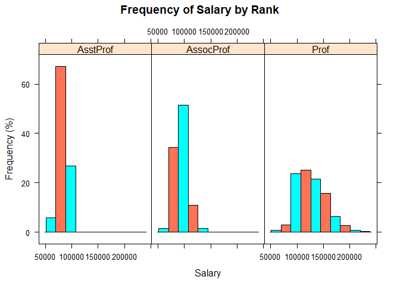

Module\_9
================
Aaron\_M
3/14/2021

``` r
library(carData)
library(ggplot2)
library(lattice)

head(Salaries,10)
```

    ##         rank discipline yrs.since.phd yrs.service    sex salary
    ## 1       Prof          B            19          18   Male 139750
    ## 2       Prof          B            20          16   Male 173200
    ## 3   AsstProf          B             4           3   Male  79750
    ## 4       Prof          B            45          39   Male 115000
    ## 5       Prof          B            40          41   Male 141500
    ## 6  AssocProf          B             6           6   Male  97000
    ## 7       Prof          B            30          23   Male 175000
    ## 8       Prof          B            45          45   Male 147765
    ## 9       Prof          B            21          20   Male 119250
    ## 10      Prof          B            18          18 Female 129000

``` r
library(dplyr)
```

    ## 
    ## Attaching package: 'dplyr'

    ## The following objects are masked from 'package:stats':
    ## 
    ##     filter, lag

    ## The following objects are masked from 'package:base':
    ## 
    ##     intersect, setdiff, setequal, union

``` r
sal_mean_yrs <- by(Salaries$salary,Salaries$yrs.service,mean)
sal_mean_yrs <- as.matrix(sal_mean_yrs)

yrs_ser <- sort(Salaries$yrs.service[!duplicated(Salaries$yrs.service)])


sal_mean_phd <- by(Salaries$salary,Salaries$yrs.since.phd,mean)
sal_mean_phd <- as.matrix(sal_mean_phd)

yrs_phd <- sort(Salaries$yrs.since.phd[!duplicated(Salaries$yrs.since.phd)])

plot(yrs_ser, sal_mean_yrs,'l',xlab='Years in Service',ylab='Average Salary',main='Average Salary by Years of Service')
```

<!-- -->

``` r
plot(yrs_phd, sal_mean_phd,'l',xlab='Years After PhD',ylab='Average Salary',main='Average Salary by Years After PhD')
```

<!-- -->

``` r
box1 <- ggplot(Salaries, aes(x = sex, y = salary)) +
        geom_boxplot() + ggtitle("Boxplot of Salaries by Sex") + theme(plot.title = element_text(hjust = 0.45)) + scale_x_discrete(name = "Sex") +
        scale_y_continuous(name = "Salary") + geom_boxplot(fill = 'orange', colour = 'blue')

box2 <- ggplot(Salaries, aes(x = discipline, y = salary)) +
        geom_boxplot() + ggtitle("Boxplot of Salaries by Discipline") + theme(plot.title = element_text(hjust = 0.45)) + scale_x_discrete(name = "Discipline") +
        scale_y_continuous(name = "Salary") + geom_boxplot(fill = 'green', colour = 'red')

box3 <- ggplot(Salaries, aes(x = rank, y = salary)) +
        geom_boxplot() + ggtitle("Boxplot of Salaries by Rank") + theme(plot.title = element_text(hjust = 0.45)) + scale_x_discrete(name = "Rank") +
        scale_y_continuous(name = "Salary") + geom_boxplot(fill = 'purple', colour = 'black')

box1
```

<!-- -->

``` r
box2
```

<!-- -->

``` r
box3
```

<!-- -->

``` r
his1 <- histogram(~Salaries$salary|Salaries$discipline, Salaries, xlab = "Salary", ylab="Frequency (%)",main='Frequency of Salary by Discipline',col = c("cyan", "coral1"), type='percent')

his2 <- histogram(~Salaries$salary|Salaries$sex, Salaries, xlab = "Salary", ylab="Frequency (%)",main='Frequency of Salary by Sex',col = c("cyan", "coral1"),type='percent')

his3 <- histogram(~Salaries$salary|Salaries$rank, Salaries, xlab = "Salary", ylab="Frequency (%)",main='Frequency of Salary by Rank',col = c("cyan", "coral1"), type='percent')


his1
```

<!-- -->

``` r
his2
```

<!-- -->

``` r
his3
```

<!-- -->

``` r
his4 <- histogram(~Salaries$sex|Salaries$rank, Salaries, xlab = "Sex", ylab="Frequency (%)",main='Frequency of Sex by Rank',col = c("cyan", "coral1"), type='percent')


his4
```

<!-- -->
